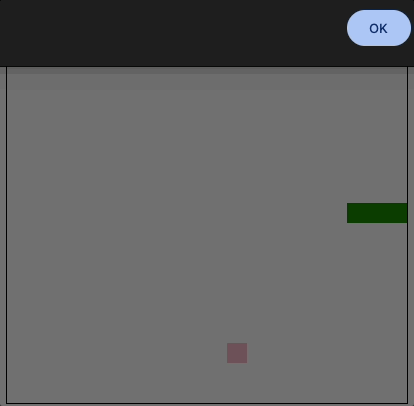

<p align="center">
  
</p>

## 🎮 Demo

<p align="center">
  
</p>

<p align="center">
<a href="https://tiagoporto.github.io/snake-game-react/" target="_blank">https://tiagoporto.github.io/snake-game-react</a>
</p>

## ✅ Status

[](https://github.com/tiagoporto/snake-game-react/actions/workflows/checks.yml?query=branch%3Amain)
[](https://github.com/tiagoporto/snake-game-react/actions/workflows/unit-tests.yml?query=branch%3Amain)
[](https://app.codecov.io/github/tiagoporto/snake-game-react)

## 🛠 Development

### Pre-requirements

- [git](https://git-scm.com)
- [nvm](https://github.com/nvm-sh/nvm)

### Install node

```bash
nvm install
```

### Install pnpm

```bash
corepack enable pnpm
```

### Install

```bash
pnpm install
```

### Running dev server

```bash
pnpm start
```

## 📋 Project Board

[Snake game](https://github.com/users/tiagoporto/projects/12)
